# September 2026

Set up vs code, repo sendiri

Beberapa pertanyaan buat dr. Agnes

emang bisa bisa ga ya kira2 batu ketika scan terlihat satu, ternyata dua (bertindihan)

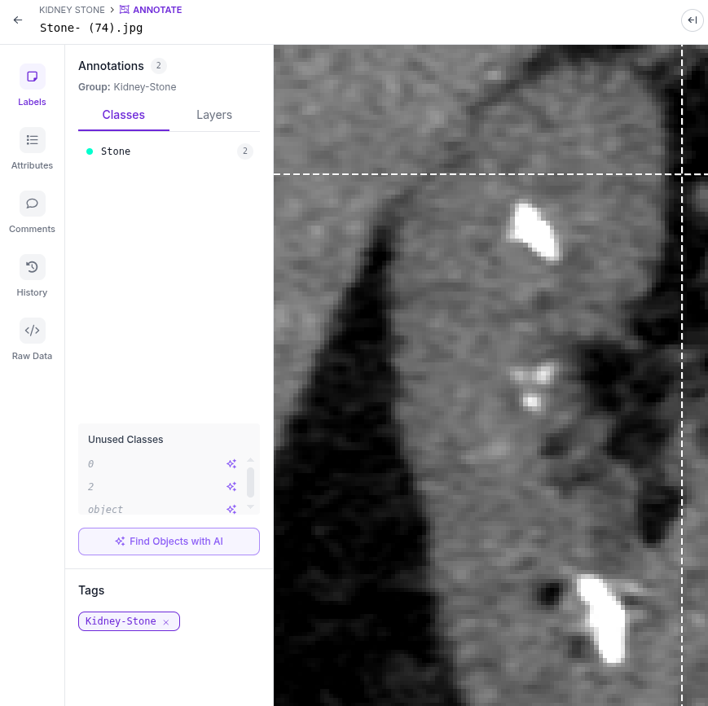
ini ada berapa?

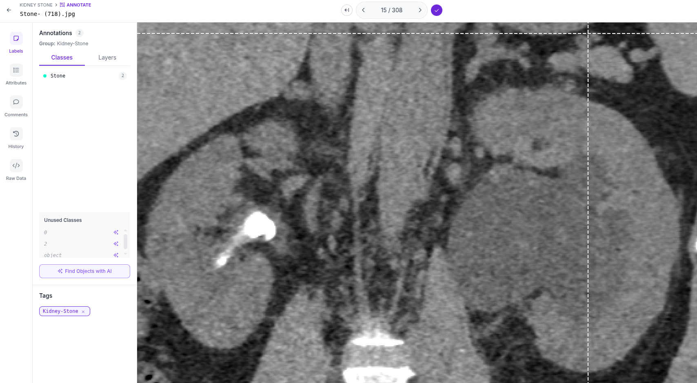
kyknya tergantung pembuat dataset deh. ada ga kemungkinan si pasien kenak batu ginjal dan cyst di waktu yang sama?

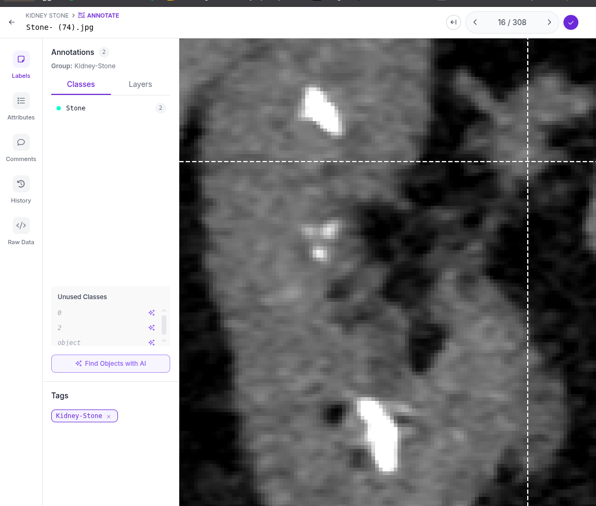
apakah batu yang ada di tengah dianggap satu atau 3?

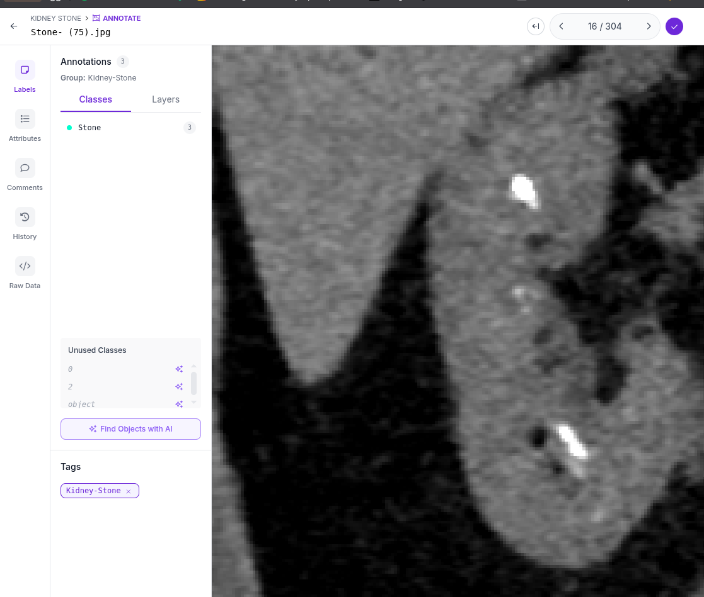
yang dicursor itu apa?

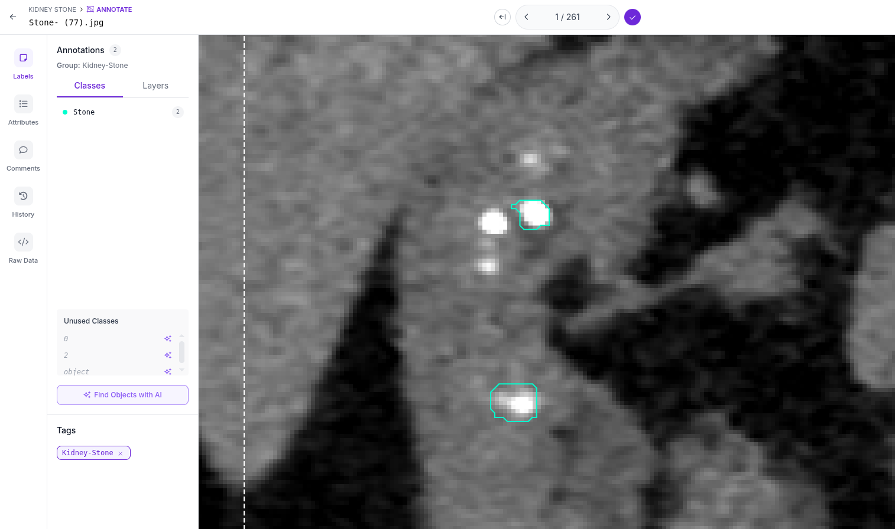
ini ada berapa batu?

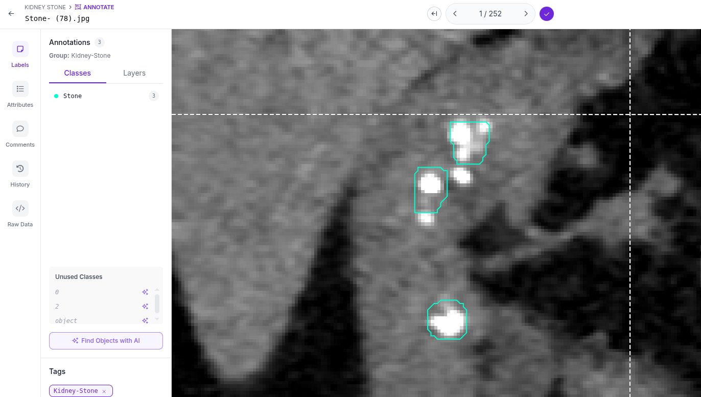
ini ada berapa batu?

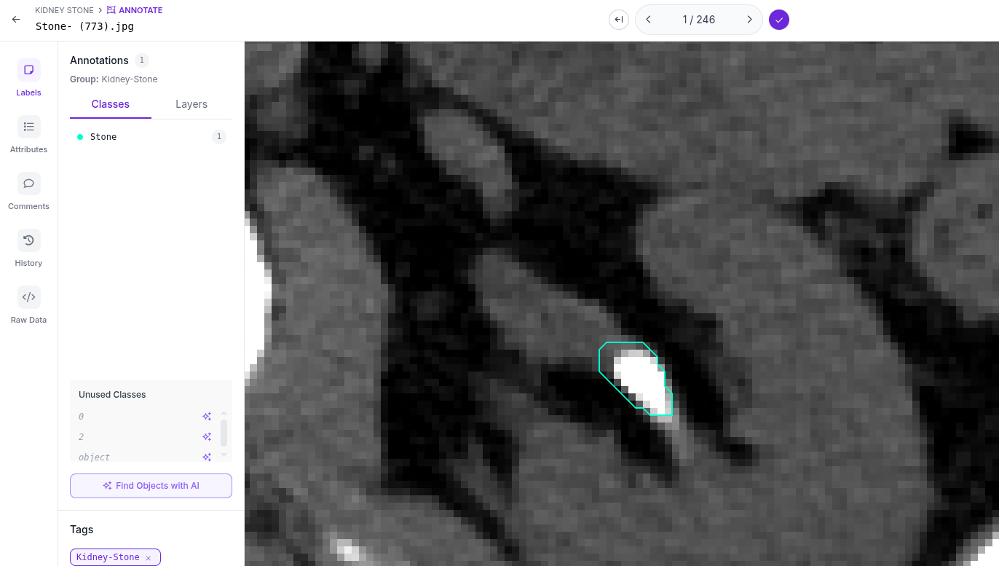
itu batu ginjal seberapa panjang?

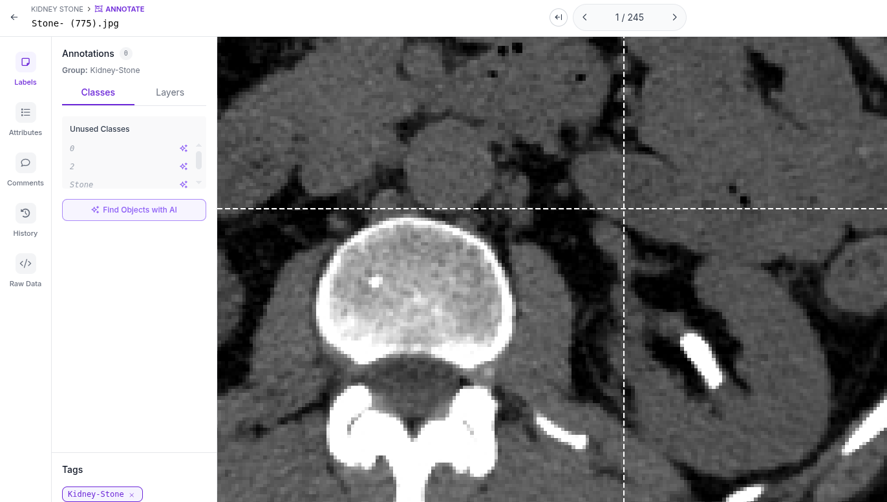
beneren batu ginjal?

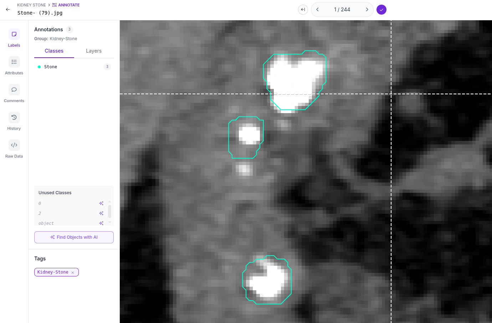
yang kecil2 ini juga batu ginjal?

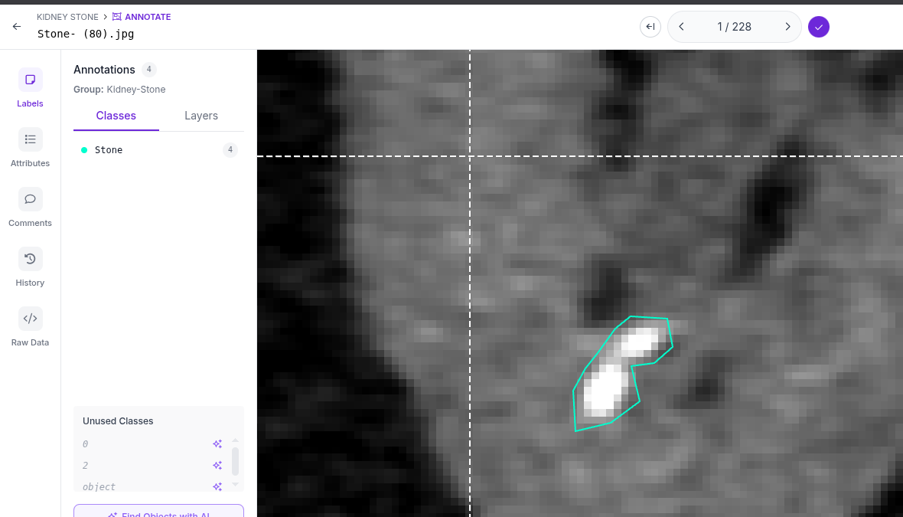
satu batu atau dua batu?

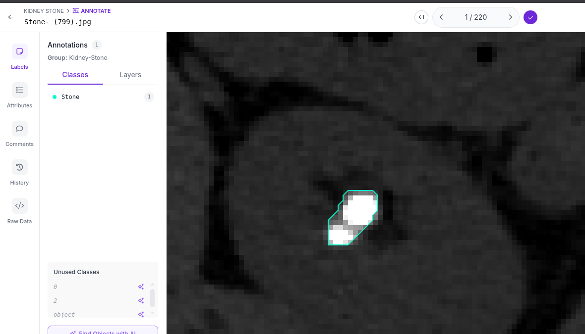
satu batu atau dua batu?

2026-09-20 22:46:31
Discovering more about Roboflow:
ada tool namanya Smart select. itu ada SAM2 dan SAM3

cara kerjanya SAM2

cara kerjanya SAM3

# Catatan Github

Setiap kali mau tutup buku, run:

1. git status
2. git add Logbook.md
3. git commit -m "" [SOMETHING]
4. git pull --rebase
5. git push
